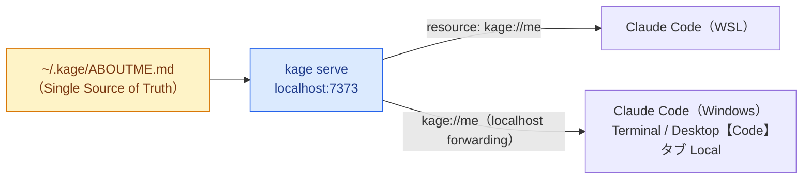

# kage（影）

**Windows + WSL2 で自分用に育てたグローバルな AI コンテキストを、複数の Claude Code に横断で届けるクロス OS の MCP サーバを、ワンコマンドで建てる CLI ツール。**

会話スタイル・進め方の好み・習熟度といった「あなたのコンテキスト」を一箇所（`~/.kage/ABOUTME.md`）に置くだけで、WSL でも Windows でも Claude Desktop でも、同じあなたとして応答が始まります。

> U-22 プログラムコンテスト 2026 応募作品。設計判断の全文は [`docs/基本設計書.md`](docs/基本設計書.md)（正典）と [`docs/references/`](docs/references/)（ADR）にあります。

---

## なぜ kage か

Windows + WSL2 の開発者は、WSL（Linux）側で育てた**グローバルな AI コンテキスト**が OS 境界で分断されています。

- Mac は単一ファイルシステムで一元管理できるが、**Windows は WSL 側のファイルシステムを跨いで設定を共有しにくい**。
- `AGENTS.md` 等はリポジトリ単位・単一ファイルシステム前提で、**ユーザーレベル（グローバル）のコンテキストが OS 境界で標準化されていない**。

結果、Windows 側の Claude Code は WSL で育てた「あなたらしさ」を知らないまま起動します。kage はこの分断を、**ローカルに MCP サーバを1つ建てる**ことで解消します。

---

## 仕組み

源は**1ファイル**（`~/.kage/ABOUTME.md`）。kage サーバがそれを MCP リソース `kage://me` として公開し、各 Claude Code がセッション冒頭に引きます。



対応する3つの「面」:

| # | 面 | 動作環境 |
|---|---|---|
| (a) | Claude Code | WSL（Linux） |
| (b) | Claude Code | Windows（Terminal） |
| (c) | Claude Code | Windows（Claude Desktop【Code】タブ・**Local 環境**） |

### 設計の核

- **SSoT（Single Source of Truth）**：コンテキストの原本は `~/.kage/ABOUTME.md` ただ1つ。編集も配信もここ一箇所で完結。
- **pull, not push**：各 Claude Code の `CLAUDE.md` には**実体を複製せず**、「`kage://me` を取りに行け」という**ポインタだけ**を書く。源は増えない。
- **無加工配信**：Markdown をそのまま返す。3面とも Markdown を読むため変換不要。
- **三状態の明示**：foreground 起動ゆえの「起動忘れ → 無言の失敗」を、`CLAUDE.md` のトリガーが
  接続失敗 / 取得失敗 / 取得成功 を冒頭1回明示することで補償する。

---

## 動作環境

- **Windows + WSL2**（WSL2 の localhost forwarding で Windows 側から WSL のサーバへ到達）
- **Rust** 1.85 以降（edition 2024）
- **Claude Code**（各面にインストール済みであること）

---

## ビルド

```bash
git clone <this-repo> kage && cd kage
cargo build                 # 開発ビルド → ./target/debug/kage
# あるいは PATH に入れる:
cargo install --path .      # → ~/.cargo/bin/kage
```

以降の例は `kage` が PATH 上にある前提です。PATH に入れない場合は `./target/debug/kage` または `cargo run --` に読み替えてください。

---

## クイックスタート

```bash
# 1. 検出・配線（各面の CLAUDE.md と MCP 設定にトリガー/接続を書く。冪等）
kage init

# 2. 源を自分のコンテキストに編集（kage init が雛形を用意済み）
$EDITOR ~/.kage/ABOUTME.md

# 3. サーバを起動（foreground。この端末を開いている間だけ生存）
kage serve

# 4. 別端末で検証（接続/取得の三状態を確認）
kage status
```

あとは**新しい Claude Code セッション**を開けば、冒頭で `kage://me` が読まれます（WSL / Windows どちらでも）。

---

## コマンド

| コマンド | 役割 |
|---|---|
| `kage init` | 3面を検出し、各面の `CLAUDE.md` にトリガー（ポインタ）を、MCP 設定（`.claude.json` の `mcpServers.kage`）に接続を配線する。**冪等**（何度実行してもプロダクション状態に収束）。配線内容を `~/.kage/registry.json` に記録。 |
| `kage serve` | MCP サーバを `localhost:7373`・**foreground** で起動。`~/.kage/ABOUTME.md` を `kage://me` として無加工配信。ポート衝突時は別ポートへ逃げず、占有プロセスの調査を案内して停止。 |
| `kage status` | サーバ到達とコンテキスト取得を検証し、**接続失敗 / 取得失敗 / 取得成功** を表示。取得成功は終了コード 0、不健全は 1（スクリプトから検知可能）。 |
| `kage uninstall` | 配線の**痕跡のみ**を撤去（`CLAUDE.md` のマーカー範囲、`mcpServers.kage` キー）。他の MCP サーバ設定・`.claude/` ディレクトリ・SSoT（`ABOUTME.md`）は残す。 |

### `~/.kage/ABOUTME.md` の書き方

会話スタイル・進め方の好み・言語/フレームワークの習熟度などを散文で記述します。境界が重要な箇所は XML タグで区切ると Claude に効きます（`kage init` が雛形を生成します）。

```markdown
<conversation_style>
結論先行で簡潔に。冗長な前置きは避ける。
</conversation_style>

<working_preferences>
大きな変更は分割して提案。コミットは1関心事で1つ。
</working_preferences>

<expertise>
Rust は中級、TypeScript は上級。前提の説明は薄めでよい。
</expertise>
```

---

## 設計上の保証（不変条件）

kage は全 Agentic 自走を前提に、以下を**絶対に破らない**よう実装されています（詳細は正典 §2 / §10-1 と各 ADR）。

1. **SSoT**：`ABOUTME.md` が唯一の源。`registry.json` は再生成可能なキャッシュであって真実ではない。冪等性の判定は現実のファイルを正とする。
2. **pull, not push**：`CLAUDE.md` に書くのは取得を促すポインタのみ。コンテキスト実体は複製しない。
3. **silent failure 禁止**：黙って直す（self-heal）のは「①直すべき終状態が一意 ∧ ②他者領域に非侵襲」の両立時のみ。欠ければ停止して観測者に委ねる。
4. **footprint 限定**：MCP 設定は `mcpServers.kage` キーのみ操作し、他サーバ設定に触れない。`.claude/` は削除しない。設定ファイルの差分は kage 自身の痕跡だけに限定する（他キーの値も再整形しない）。
5. **固定ポート衝突は逃げない**：別ポートへフォールバックせず、占有調査を案内して停止する。

---

## 技術スタック

- **言語**：Rust（単一バイナリ配布・速度・低レイヤーの堅牢さ）
- **MCP**：[rmcp](https://crates.io/crates/rmcp) 2.x（公式 Rust SDK。プロトコルは自作しない）
- **配信**：HTTP Streamable / `127.0.0.1` / 固定ポート `7373` / foreground
- **形式**：純 Markdown・無加工配信・MCP **Resource**（`kage://me`）

---

## スコープ

### MVP（本リリース）
- CLI ツール（`init` / `serve` / `status` / `uninstall`）
- 対象3面（すべて Claude Code）・Windows + WSL2・純 Markdown

### やらないこと（意図的な割り切り）
- 非 Claude ツール対応 ／ ファイル投影・自動注入（実体複製は SSoT を壊す）
- Desktop【Code】タブの Remote / SSH 環境（localhost 共有設計の構造的帰結で不達）
- Markdown → 他形式変換 ／ 複数マシン同期 ／ ポート占有プロセスの PID 識別

### 提出版で追加予定（差別化）
- Claude Desktop **アプリ本体**（`CLAUDE.md` 機構を持たない異種ターゲット）への対応
- MSIX 仮想化パスの吸収

---

## ドキュメント

- **正典**：[`docs/基本設計書.md`](docs/基本設計書.md) — 何を・なぜ作るかの最終権威。
- **ADR**：[`docs/references/`](docs/references/) — 却下した代替案とその理由（self-heal/stop の2軸、Local 限定、foreground、固定ポート、`.claude/` 検出、face(c) 接続収束）。
- **開発規律**：[`CLAUDE.md`](CLAUDE.md) — 本リポジトリで AI エージェントが従う開発規律。

---

## ライフサイクル

```
kage init      # 配線（冪等・registry に記録）
  ↓
kage serve     # 配信（foreground）
  ↓
kage status    # 検証（三状態）
  ↓
kage uninstall # 撤去（痕跡のみ・SSoT は残す）
```

`init → uninstall → init` は綺麗に往復し、何度繰り返しても状態は収束します。
