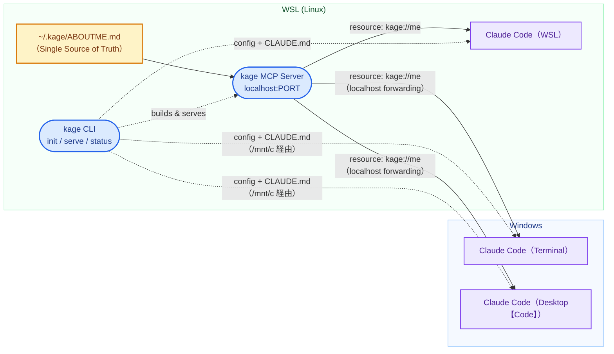

## 0. 要約

Windows + WSL2 環境で自分用に育てたグローバルなAIコンテキストを、複数の Claude Code に横断で届けるクロスOSのMCPサーバを、ワンコマンドで建てるCLIツール。

## 1. 背景と課題（誰の・どんな課題か）

### 1-1. 誰の課題か

Windows + WSL2の開発者は、WSL（Linux）側で育てたグローバルなAIコンテキスト（会話スタイル・進め方の好み・習熟度など）が、OS境界とツール間で分断されている。Windows側の面はそのコンテキストを知らないまま起動する。逆も基本的には同様。

### 1-2. 背景

#### Windows + WSLにしか存在しない課題

- Macユーザーは単一ファイルシステムで一元管理が容易
- WindowsがLinux側のファイルシステムへアクセス不可
- Windows, Linux個別管理は保守性が低い

#### 未標準化

- `AGENTS.md` はリポジトリ単位・単一ファイルシステム前提。
- ユーザーレベル（グローバル）のコンテキストがOS境界で標準化されていない

## 2. ゴールと成功の定義

### 2-1. ゴール

ローカルにMCP サーバを 1つ建てるだけで、要求時に以下の面が同一のコンテキストファイルを読める状態を作る。

|#|面|動作環境|
|---|---|---|
|(a)|Claude Code|WSL（Linux）|
|(b)|Claude Code|Windows (Terminal)|
|(c)|Claude Code|Windows（Claude Desktop【Code】タブ・Local 環境）|

(c) の限定について。Claude Desktop【Code】タブは起動時に動作環境（Environment）を Local / Remote / SSH から選択する。kage の対象は Local のみ。Remote / SSH は構造的に対象外。確定までの経緯と棄却理由は ADR-0002 を参照。

### 2-2. 成功の定義

1. 上記3面が、ユーザーのセッション冒頭トリガーで `kage` の resource を引き、コンテキストを読める。
2. コンテキストの源が一箇所にあり、編集も一箇所で完結する。
3. 全構築・配線がワンコマンドで実行できる。

## 3. スコープ

ツールの責任範囲は、環境整備（MCP サーバーへの到達経路と MCP 接続のポインタ配線）まで。これはツールが機械的に検証する。配信されたコンテキストが LLM のレスポンスに反映されるかどうかは機械的に保証できないため、責任は MCP を利用する AI エージェント（Claude Code）に委譲する。

### 3.1 MVP

- 製品：CLIツール（Markdownファイルは製品本体ではない）
- 対象：上記3面（すべて Claude Code）
- OS：Windows + WSL2
- コンテキスト形式：純Markdown

### 3.2 コンテスト提出版で追加する差別化

#### Claude Desktop アプリ本体の追加

- CLAUDE.md 機構を持たない異種ターゲットの追加

#### MSIX 仮想化パス問題の吸収

- `Edit Config` が開くパスと、アプリが実際に読むパスのズレを検出
- 正しい `claude_desktop_config.json` へ書き込む

### 3.3 やらないこと（影響範囲・優先度・コストで判断）

| やらないこと                       | 理由                                                                                                                                                      |
| ---------------------------- | ------------------------------------------------------------------------------------------------------------------------------------------------------- |
| 非Claudeツール対応                 | ・範囲爆発。Claude一族に絞って完走を取る                                                                                                                                 |
| ファイル投影型・自動注入                 | ・能動・MCP一本に決定済み。<br>・コンテキスト実体の複製配置はSSoTを破壊するため不採用。<br>・CLAUDE.mdへの取得トリガー配線は実体ではなくポインタの配置（§7-3・§12 参照）                                                    |
| Code タブの Remote / SSH 環境への配線 | ・localhost で1インスタンス共有する設計の構造的帰結として不達（棄却理由は ADR-0002）                                                                                                    |
| Markdown → 他形式の変換            | ・3面とも Markdown を読む。<br>・MVPに不要。<br>・散文本体のJSON化はニュアンスを殺すため将来も慎重                                                                                          |
| 複数マシン同期                      | ・後。まず1マシン内のクロスOSを解く                                                                                                                                     |
| frontmatter による構造化           | ・純Markdownで開始。構造化は拡張時に検討                                                                                                                                |
| ポート占有プロセスの識別                 | ・占有者が前回の kage 自身か他プロセスかを PID で区別しない。<br>・希少（異常終了時のみ）× 低被害（占有調査導線で自己解決可）× 高コスト（PID保存＋stale検証）で見合わない。<br>・識別はユーザーの調査コマンドに委ねる（衝突時 stop の文脈は §5-7・ADR-0004） |


## 4. 製品定義

|層|役割|
|---|---|
|ビルドツール（製品の主役）|サーバを建て、検出した各面の設定へ配線する CLI。「面倒を一コマンドに畳む」ことそのものが価値|
|ランタイム|Markdownのグローバルコンテキストを MCP resource として公開するローカルサーバ|

補足。`kage` は「私のコンテキストそのもの」ではなく「Windows+WSL民なら誰でもクロスOS配線を一発で建てられるツール」。

## 5. 技術選定と根拠

### 5-1. 言語：Rust

- 単一バイナリ配布・速度・低レイヤーの堅牢さ。

### 5-2. 開発土台：rmcp (公式 Rust SDK)

- 公式サポートによる仕様追従の安心感
- 実装の土台は自作しない

### 5-3. 配信方法：HTTP (Streamable HTTP)

- localhostで1インスタンスをOS間で共有
- stdioはクライアント毎にプロセスを起動し、単一共有インスタンスにできないため不採用

### 5-4. コンテキスト形式：純Markdown

- `ABOUTME.md` は統合・曖昧性解決タスク
- Claude Code は3面ともMarkdownでコンテキストを読むため変換不要

### 5-5. 配信モデル：MCP Resource

- 情報源を単一インスタンスに保つ
- MCPサーバーへの接続経路とポインタ配線の機械的不確実性は `kage status` で検証し可視化・補強
- URIで決め打ち参照が可能で、モデルのツール選択判断に委ねないためMCP Toolは不採用

### 5-6. kage serve ライフサイクル：foreground

- `kage serve` を実行したターミナルが開いている間だけサーバが生存する foreground モデルを採用。
- 採用根拠：
    - 実装コスト最小。
    - プロセスの生死がターミナルに可視化され、§10-1「失敗を無言にしない」と最も整合する（起動状態がユーザーにも分かりやすい）。
- 制約：
    - 生存は「WSL が稼働している」ことに依存する（WSL2-VM 寿命）。
    - VM シャットダウン後の復帰はユーザーの次回 `kage serve` に委ねる。
- 構造的弱点と補償：
    - 「起動忘れによる無言の失敗」を招く。
    - §7-3 の三状態明示トリガーで補償する。
- 常駐デーモンを採らない理由・client-spawned の消滅経緯 → ADR-0003

### 5-7. ポート方針：固定ポート

- kage は固定ポート（実装時に番号確定）を使用する。
- 採用根拠（要点）：
    - 各面の MCP 設定に書くエンドポイントが固定文字列で済み、serve のたびに番号が変わる「クロスOS追従問題」を構造的に回避する。
    - 動的ポート（OS から空き取得）より実装が軽い。
- 受容するリスク：固定ポートは衝突を防げない。対象ポートが他プロセスに占有されていると起動できない。この不便さは意図的に受容する（§3.3 相当）。
- 衝突時の態度：別ポートへ逃げず、占有プロセスの調査・停止をユーザーに案内して終了する（stop）。これは ADR-0001（self-heal vs stop の2軸）のインスタンスで、§10-1 と整合する。
- 動的ポート棄却の詳細トレードオフ・衝突 self-heal が2軸で落ちる導出 → ADR-0004
- ポート占有プロセスの識別（ゾンビ判定）を行わない → §3.3「やらないこと」

## 6. システム構成 + アーキテクチャ図



- 正規の源 `~/.kage/ABOUTME.md`（1ファイル）→ `kage` サーバが resource として公開。
- 各Claude Code は起動時トリガーでresourceを引く
- Windows側の面は localhost フォワーディングで到達する。
- CLI がサーバを建て、検出した各面の MCP 設定へ配線する。

## 7. 主要な技術的難所

### 7-1. クロスOS到達

- WSL2のlocalhost フォワーディングを利用
- Windows Claude CodeとWSLサーバの経路確立

### 7-2. 設定配線

- WSL Claude CodeとWindows Claude Code 双方の MCP 設定
- 整合した形で書き込む

### 7-3. トリガー導線

- セッション起動時に resource が確実に引かれる最小 bootstrap を各面へ仕込む。
- 各面の `CLAUDE.md` に「kage MCP Server から `kage://me` を取得すること」というポインタ（取得指示） を仕込む。
- 配置するのはポインタのみで、コンテキスト実体は複製しない（§12「自動注入(push) と 自動トリガー(pull) の区別」）。

#### 起動モデル：冒頭1回の自動トリガー（pull）

- ユーザーが毎回手で「コンテキストを読んで」と明示するのではなく、CLAUDE.md によるセッション冒頭1回の自動トリガーを採用する。
- 毎回手で起動させるのは §0 のワンコマンド思想／§4「面倒を一コマンドに畳む」体験を損なうため。
- これは §3.3 の「自動注入はやらない」と矛盾しない。
- 提供するのはコンテキスト実体の複製配置
- トリガーは取得を促すポインタの配置であり、kage は終始リソースを提供するだけ。
- 実体は MCP Server 内に単一存在し続け、SSoT は保たれる。

#### 三状態の明示（foreground 採用の補償）

- `kage serve` は foreground 採用（§5-6）
- 「サーバ起動忘れ → resource を引けない → Claude Code がコンテキスト無しで応答する」という無言の失敗が構造的に発生しうる。
- これを §10-1 堅牢性（失敗を無言にしない）と整合させるため、CLAUDE.md のトリガー指示に三状態の明示ロジックを持たせ、AI エージェント（Claude Code）に失敗検知を委譲する。
- 接続失敗（サーバ未起動など）／取得失敗（リソース不在・空など）／取得成功 の3状態を、セッション冒頭の最初のレスポンスでのみ明示する。
- 2回目以降のリマインドは行わない（汚染を冒頭1回に封じ込める）。
- 失敗状態のときは `kage status` での検証導線を添える。
- この検知は LLM の確率的挙動に依存するため機械的保証はできないが、それは「放棄」ではなく「適切な主体への委譲」である（§3 の責任境界と同型）。

#### 具体案

```markdown
<!-- `kage init` で追加されました -->
## 1. 依頼

- @kage://me からコンテキストを取得
- §2 の状態に応じて、内容をレスポンスに追加
- §3 のルールを必ず守ること
  
## 2. 状態と内容

- サーバー接続の失敗 → 「kage Serverへの接続に失敗」
- サーバー接続に成功、コンテキストの取得に失敗 → 「Contextの取得に失敗」
- コンテキスト取得に成功 → 「Contextの取得に成功」

## 3. ルール

- レスポンスへの追加は **セッション起動後、最初のレスポンスのみ**
- 2回目以降のリマインドは不要
- レスポンス内容が**失敗**の場合には「`kage status`で検証してください」をレスポンスに追加する
<!-- `kage init` で追加されました -->
```

このプロンプトは完全版ではない。成功／失敗のラベルが明示されていないため、雛形設計で再び判断が必要。

### 7-4. MSIX 吸収

- Claude Desktopアプリ本体の仮想化パスを検出し、正しい `claude_desktop_config.json` へ書き込む。
- これは §3.2 の差別化（Desktop **アプリ本体**追加）に固有の難所。MVP の (c)【Code】タブ Local は Claude Code 本体を実行し `.claude.json` に配線するため MSIX 非依存（ADR-0006）。

## 8. データ構造

### 8-1. MCP Resource

- `~/.kage/ABOUTME.md` をそのまま返す（リソース名：`kage://me`）
- 加工・変換を行わず、Markdown形式で配信する

### 8-2. ABOUTME.md

- 会話スタイル / 進め方の好み / 言語・フレームワーク習熟度を散文で記述
- 節の境界が重要な箇所はClaude相手に有効のため、XMLタグで区切ることを推奨

### 8-3. CLAUDE.md

- kage MCP Serverの `kage://me` リソースを読み込む指示（ポインタ）と、§7-3 の三状態明示ロジックを記述
- Windows (`C:/Users/[username]/.claude/CLAUDE.md`)
- WSL / Linux (`/home/[username]/.claude/CLAUDE.md`)
- (c) Desktop【Code】タブ Local 環境は、上記 Windows グローバル CLAUDE.md を読むことを実機確認済み（配線先は (b) と収束）

### 8-4. 状態・設定の保存場所（ `~/.kage/` ）

`~/.kage/` に物理配置するのは、以下の2種のみ。

|配置物|性質|説明|
|---|---|---|
|`ABOUTME.md`|実体（Single Source of Truth）|コンテキストの唯一の原本。MCP Resource `kage://me` の実体|
|`registry.json`|動的な状態（配線台帳）|init が各面に行った配線の undo 情報。§8-5|

保存しないもの（導出・同梱で代替）：

- 規約で導出できるパス（各面の `.claude/` パス等）：
    - `[username]` を実行時に環境（`$HOME` 等）から取得
    - 雛形と合成して毎回生成する。保存すると二重管理になる（SSoT 違反）。
- 固定値（ポート番号・バインドアドレス・リソース名 `kage://me`）
    - 実行時に変わらないためコードに組み込む。
- CLAUDE.md 雛形：
    - ユーザーの編集による配線の不定化を防ぐ
    - 再現性（同じ kage は同じ雛形を配線する）を保証するためにバイナリに埋め込む
    - `~/.kage/` には置かない。
- PID・アクセスログ：MVP では保存しない（PID 非保存の根拠は §3.3 のゾンビ判定行・ADR-0004、アクセスログは後述の方針）。

#### アクセスログを持たない理由

kage の責任範囲は「アクセス可能な環境が整っているか」の調査可能性までで、これは `kage status`（現在の状態確認）が担う。「いつ・どの面が引いたか」という履歴の蓄積は MVP の成功の定義に寄与せず、§3.3 側。`kage status` は「現在の検証」という単一責任に閉じ、履歴表示の役割は負わせない。

### 8-5. 配線台帳 `registry.json`

init が各面に施した配線を、アンインストール時に安全に取り消すための情報を記録する。「現状の記録」ではなく「取り消し手順の記録」である点が要。

データ構造に規定されるため、戦略ごとにグルーピングする。

- `prompt` グループ（CLAUDE.md 系）：プレーンテキストのため位置（マーカー）で範囲特定する。kage が追記した範囲を `<!-- kage init で追加されました -->` マーカーで囲み、undo はその範囲を切り取る。
- `connection` グループ（MCP 設定 JSON 系）：構造化データのためキーで特定する。`mcpServers` 配下の `kage` キーのみを削除し、他サーバ設定には触れない。
- → prompt（自分の痕跡＝ファイルごと削除可）と connection（他者共有＝キーのみ）の非対称は ADR-0001 ②非侵襲の適用。新たな基準ではない。

操作種別の記録：

- prompt 側：
    - `isCreated`（kage がファイルを新規作成したか／既存に追記したか）を各ターゲットに持つ。
    - `true`（新規作成）→ undo はファイルごと削除。
    - `false`（追記）→ undo はマーカー範囲のみ削除。
- connection 側：
    - `isCreated` を持たない。
    - 配線先は各面の `.claude.json` のトップレベル `mcpServers`（`settings.json` / `claude_desktop_config.json` ではない。確定の経緯は ADR-0006）。他の MCP サーバと共有のファイル。
    - 形式は `"kage": { "type": "http", "url": "http://127.0.0.1:<PORT>/mcp" }`。
    - ファイルごと削除すると他サーバ設定を巻き添えにする
    - 常に kage キーのみ削除に徹する。
    - kage キー削除前に `mcpServers` キーの存在を検証する。
    - (c) Desktop【Code】タブ Local は (b) と同一の `.claude.json` に収束し独立ターゲットを増やさない（prompt 側の ADR-0002 収束を connection へ延長＝ADR-0006）。
- 割り切り（空 mcpServers 残骸の許容）：
	- connection を新規作成していた場合、undo 後に空の mcpServers が残骸として残りうるが意図的に許容する。清掃は無寄与（高頻度ゆえユーザーが別 MCP ツールで再生成）×低便益で、Arcana 第3「やらないこと」のインスタンス。
	- パスは解決済みの実パスを焼き付ける。undo 対象の同一性を保証するため、台帳には `[username]` を解決した実パス（例 `/home/takumi/.claude/CLAUDE.md`）を記録する。§8-4「導出できるものは保存しない」の例外に当たるが、同一性保証という別の要件がこれを上回る。

エントリは検出された面の数だけ動的に増える。中身は init 実行時にしか確定しない。

構造イメージ（キーは実装時に確定。下記は設計意図の表現）：

```jsonc
{
  "prompt": {
    "type": "markdown",
    "marker": "<!-- kage init で追加されました -->",
    "targets": {
      "wsl":     { "path": "<解決済み実パス>", "isCreated": false },
      "windows": { "path": "<解決済み実パス>", "isCreated": true  }
    }
  },
  "connection": {
    "type": "json",
    "key": "kage",
    "file": ".claude.json のトップレベル mcpServers（ADR-0006）",
    "targets": {
      "wsl":     { "path": "<解決済み実パス（$HOME/.claude.json）>" },
      "windows": { "path": "<解決済み実パス>" }
      // (b) Win Terminal と (c) Desktop【Code】タブ Local は windows を共有（ADR-0006）
    }
  }
}
```

#### 残課題（実装フェーズで確定）

- ~~connection 側の各設定ファイルの正確な所在は面ごとに異なり、特に (c) Desktop は MSIX 仮想化でパスがズレうる（§7-4）。検出して実パスを台帳へ焼き付ける。~~
    - **解決済み（ADR-0006・実機検証 2026-06-30）**：connection 配線先は各面 `$HOME/.claude.json` のトップレベル `mcpServers`。(c) Desktop【Code】タブ Local は (b) と同一の `.claude.json` に収束（独立 desktop ターゲット廃止）。MSIX 仮想化は Desktop アプリ本体（§3.2）に限定され【Code】タブ MVP は非依存。実パス（symlink は追記対象の実体パス）は従来どおり台帳へ焼き付ける。
- 三状態明示トリガー文において、「状態」と「ルール」の参照整合（どの状態が「失敗」かのラベル明示）を CLAUDE.md 雛形確定時に詰める。

## 9. CLI 設計

| コマンド          | 役割                                                                                                                     |
| ------------- | ---------------------------------------------------------------------------------------------------------------------- |
| `kage init`   | ・サーバ雛形と `ABOUTME.md` 雛形の生成<br>・各面を検出し、検出した面へMCP設定配線<br>・各面の `CLAUDE.md` へ最小トリガー配線 (指示構築)<br>・配線内容を `registry.json` へ記録 |
| `kage serve`  | MCP サーバを起動（`localhost:固定PORT`・foreground）。ポート衝突時は占有プロセスの調査・停止を案内して終了                                                   |
| `kage status` | ・kage MCP Server 生存検証<br>・`CLAUDE.md` にResource取得指示が記述されているかの検証<br>・各面 (Windows / Linux) からサーバー接続到達を検証                 |

### 9-1. 面の検出ロジック方針

- 検出の目的：Claude Code を「起動できるか」ではなく、kage が書き込む先（`.claude/` ディレクトリと設定ファイル）が存在するか／書き込めるかを知ること。kage は Claude Code を起動しない。
- 検出対象：`.claude/` ディレクトリの存在（書き込み先）で判定する。`claude` 実行コマンドの有無では判定しない（false negative を招くため。棄却の導出は ADR-0005）。
- 不確実性の吸収：`.claude/` の生成タイミングに検出を依存させない。検証して無ければ kage が先回り作成する（registry.json に `isCreated: true` で記録）。これは ADR-0001 の self-heal インスタンス（終状態が一意・無害な標準ディレクトリで非侵襲ゆえ）。
- 対象3面の検出先：
    - (a) WSL：`/home/[user]/.claude/`
    - (b) Windows Terminal：`/mnt/c/Users/[user]/.claude/`（WSL から到達）
    - (c) Desktop【Code】タブ Local：グローバル `~/.claude/CLAUDE.md` を読むことを実機確認済み。配線先は (b) と収束しうる（ADR-0002）
    - Remote / SSH 環境は §3.3 により対象外。

### 9-2. 冪等性・衝突解決

- 列挙源＝§9-1 検出（registry 非依存・全面を訪れる）
- prompt 側＝マーカーによる upsert（無→構築／現行版→no-op／旧版→範囲置換）。CLAUDE.md は共有ファイルゆえ部分操作に徹する（§8-5 connection と同型）
- registry＝真実ではなくキャッシュ（真実は現実のファイル＝Arcana 第9 SSoT）。判定に使わず init が現実から再生成。ゆえに registry 削除は冪等性にとって非イベント
- 孤児（ファイルに在る・台帳に無い）＝drift とみなし現実を正として self-heal。これは ADR-0001 の self-heal インスタンス（①現実が一意の正・②自分の痕跡ゆえ非侵襲）。§5-7 の stop が適用されないのは衝突相手が他プロセスでなく自分の痕跡だから（②が立つ）。
- init の性質変化＝2回目以降は「配線」ではなく reconcile（意図×前状態×現実の突き合わせ→現実へ収束）

### 9-3. アンインストール設計

- prompt（CLAUDE.md）：`isCreated: false`→マーカー範囲のみ削除（ユーザー記述温存）／`isCreated: true`→ファイルごと削除
- connection（settings.json 等）：`mcpServers.kage` キーのみ削除（事前に `mcpServers` 存在検証）。ファイルは残す。空 `mcpServers` 残骸の意図的許容は §8-5 を参照。
- `.claude/` ディレクトリ：削除しない。ペルソナ（Claude 継続利用者）下で削除ユースケースが存在せず、成功の定義に非寄与・コスト高ゆえ §3.3 として除外。`isCreated` は prompt 側のファイル削除判断にのみ使い、ディレクトリには波及させない

整合メモ。`isCreated` の役割は prompt のファイル削除分岐に一本化。ディレクトリ削除自体を落としたことで、未確定だった「ディレクトリ削除の最終ゲート＝中身チェック」はまるごと不要。設計が1つ削れ、`isCreated` の意味も一意になった。スコープを切ると下流の複雑さも連鎖的に消える好例。

## 10. 非機能要件

|項目|方針|根拠|
|---|---|---|
|性能|初回応答の体感速度を重視|「速い道具」の説得力|
|堅牢性|配線・到達の失敗は無言を明示エラー|コンテキストが読み込まれているかどうかの検証を可能にするため、 `kage status` で可視化|
|可搬性|単一バイナリ配布|Rust の利点を最大化|

### 10-1. エラーハンドリングの不変条件

エラー時の振る舞いは、ケースを個別に列挙して決めるのではなく、全操作（init / serve / status / uninstall）を貫く一つの判断基準で決める。上表「堅牢性」をこの不変条件として展開する。

避けるべき状態

- silent failure（無言の失敗）＝失敗しているのに何も告げず、利用者が成功と誤認する状態。これを最大の敵とする。
- §7-3 の三状態明示・§5-7 のポート衝突明示は、この回避の個別適用。

self-heal（黙って直す）か、止めるかの分岐

次の2軸が同時に成立するときにのみ self-heal を許す。

1. 正解が一意に確定する（直すべき終状態が曖昧でない）
2. 他者の領域に非侵襲（kage 自身の痕跡の範囲に閉じ、他者が意図して設定した状態を侵さない）

どちらか一方でも欠ければ、止まって観測者（ユーザー / CLAUDE.md 経由の AI エージェント）へ明示し、判断を委ねる。

#### 棄却した代替案の経緯は本書に持たない

「内部／外部要因」「他者影響の有無のみ」といった単一軸を反例とともに棄却して 2軸 AND へ収束した経緯は、設計者の思考ログであり再判断の入力にならないため正典に載せない。経緯は ADR、汎用原則は Arcana.md に分離する。本書は判断基準のみを持つ。

## 11. 対応環境

- OS：
    - Windows + WSL2（1マシン内のクロスOS）
- 対象面：
    - (a) WSL Claude Code
    - (b) Windows Terminal Claude Code /
    - (c) Claude Desktop【Code】タブ Local 環境のみ
- 対象外：
    - Code タブの Remote / SSH 環境
    - 非Claudeツール
    - 複数マシン同期（いずれも §3.3）
- 前提制約：
    - サーバの生存は「WSL が稼働している」ことに依存する（§5-6 foreground、WSL2-VM 寿命）
    - VM シャットダウン後の復帰はユーザーの次回 `kage serve` に委ねる。

## 12. 設計用語：自動注入と自動トリガー の区別

kage の根幹に関わる概念のため明文化する。両者は「ファイルを物理的に置く」点では同じだが、置かれるものの性質が決定的に異なる。

|項目|自動注入（push）|自動トリガー（pull）|
|---|---|---|
|置くもの|コンテキストの実体（中身）の複製|取得を促すポインタ（参照）|
|原本|複製が増殖し SSoT が崩れる|実体は MCP Server に1つ。原本は増えない|
|kage の方針|やらない（§3.3）|採用（§7-3 トリガー導線）|

- `kage init` が CLAUDE.md に書き込むのは「`kage://me` を取りに行け」というポインタのみであり、コンテキスト実体は複製しない。よって §3.3「自動注入はやらない」と矛盾しない。
- アナロジー：友人の住所を伝えるのに、家を複製して庭に建てる（push）のではなく、住所を書いた紙を貼る（pull）。家は1軒のまま。
- 転移概念：参照渡し vs 値渡し、正規化 vs 非正規化、キャッシュ戦略。undo の容易さも含め、構造を持つ参照ほど安全に扱える。

## 付録：判断が必要な足りない要素

確定済み

- ~~`kage serve` のライフサイクル~~
    - §5-6（foreground）
- ~~状態・設定の保存場所と `~/.kage/` ディレクトリ構成~~
    - §8-4・§8-5
- ~~面（各Claude Code）の検出ロジック方針~~
    - §9-1
- ~~対応環境の明示~~
    - §11
- ~~冪等性と既存設定との衝突解決（2回目以降の init / serve）~~
    - §9-2（init 再実行＝reconcile）
- ~~撤去・アンインストール~~
    - §9-3（痕跡のみ除去・reconcile の逆方向）
- ~~エラーハンドリング（横断的方針）~~
    - §10-1（silent failure 回避／self-heal は2軸AND）
- 付随確定
    - ポート方針 §5-7
    - トリガー導線の起動モデルと三状態明示 §7-3
    - push/pull 区別 §12

部分確定（Phase 0 スパイク 2026-06-30）

- セキュリティ断定（localhost binding、Origin ヘッダ検証等 MCP spec 準拠）
    - **充足（rmcp 2.0.0 標準）**：`StreamableHttpServerConfig` は既定で `allowed_hosts: [localhost, 127.0.0.1, ::1]` の Host 検証（DNS rebinding 対策）を持ち、bind は `127.0.0.1`（loopback）。
    - **未確定**：`allowed_origins` 既定（空）の挙動と Origin ヘッダ検証の要否は実装時に確認。
- 検証戦略
    - ~~各面設定ファイルの実パス確認 / (c) Desktop パス確認~~ → **解決済み（Phase 0・ADR-0006）**：connection＝各面 `$HOME/.claude.json` トップレベル `mcpServers`、(c) は (b) に収束。クロスOS到達（NAT モードで Windows→WSL）・rmcp 起動・無加工配信も実証済み。
    - `.claude/` 生成タイミング：3面とも実在を確認。不在時の先回り作成（§9-1・ADR-0005）は Phase 3 で temp dir 単体テスト。

未確定（次回以降の壁打ち対象）

- CLIのUX
